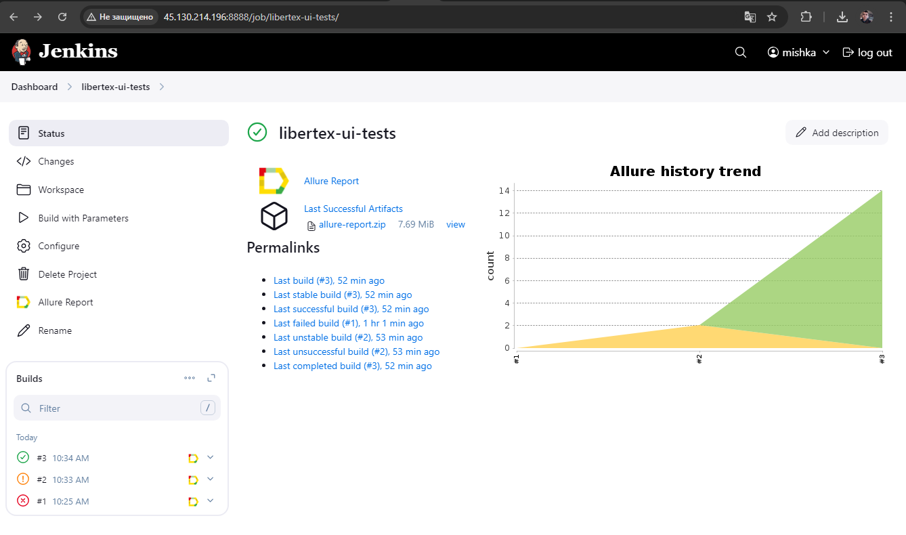
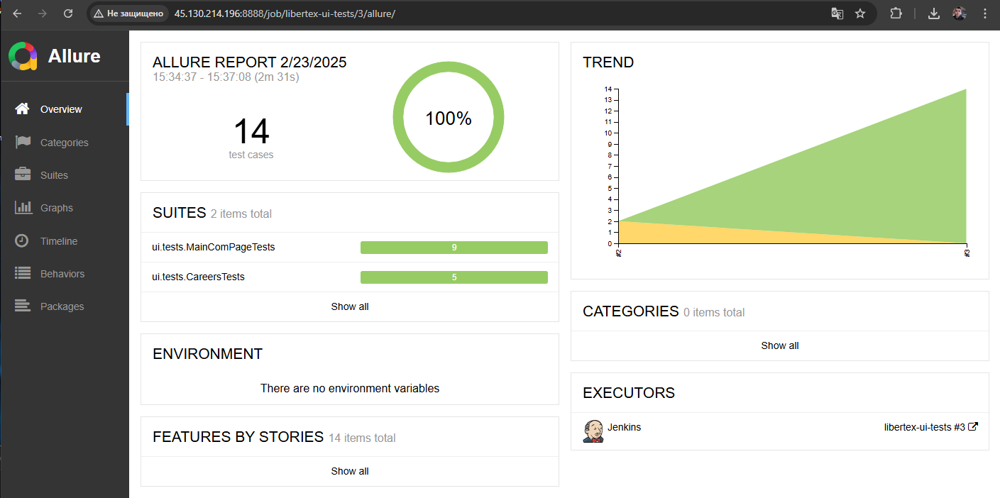
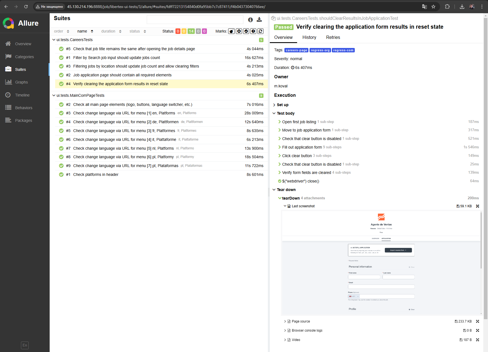
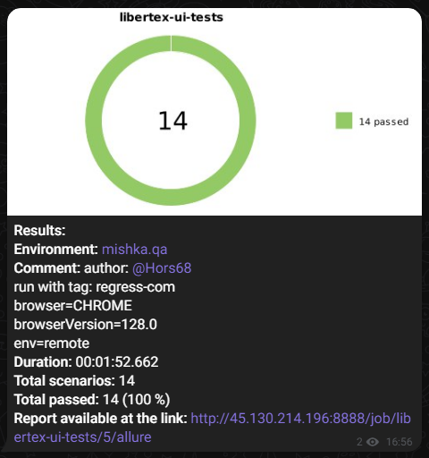
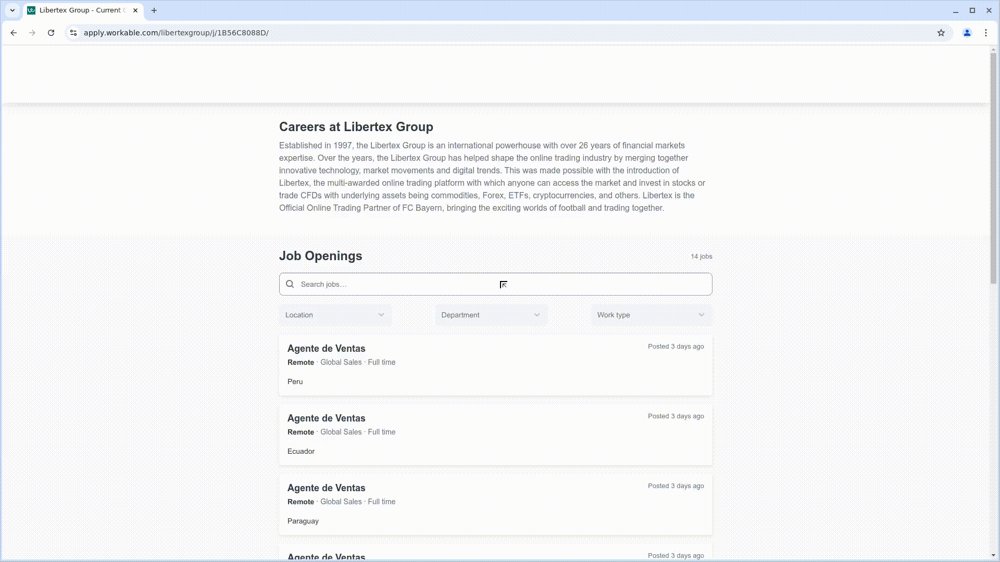

# Libertex Test Automation Project

## 📌 Contents:

- [Technology Stack](#computer-technology-stack)
- [Running Tests](#running_woman-running-tests)
- [Jenkins Build](#-jenkins-build)
- [Example of Allure Report](#-example-of-allure-report)
- [Telegram Notifications Using a Bot](#-telegram-notifications-using-a-bot)
- [Video Example of Test Execution in Selenoid](#-video-example-of-test-execution-in-selenoid)

---

## 💻 Technology Stack

<p align="center">


</p>

Automated tests are written in `Java` using `JUnit 5` and `Gradle`. For UI testing, the framework [Selenide](https://selenide.org/) is used. Tests can be executed locally or via [Selenoid](https://aerokube.com/selenoid/). Additionally, test execution is integrated with `Jenkins`, generating an `Allure` report and sending test results to `Telegram` after completion.

### Allure report includes:

- Test execution steps;
- Screenshot of the browser at the end of the test;
- Page source;
- Browser console logs;
- Video recording of the test execution.

---

## 🏃‍♀️ Running Tests

### Running Tests Locally

```
./gradlew clean test -Denv=local
```

To override default parameters:

```
./gradlew clean test
-Denv=${ENV}
-Dbrowser=${BROWSER_NAME}
-DbrowserVersion=${BROWSER_VERSION}
-DbrowserSize=${BROWSER_SIZE}
-DbaseUrl=${BASE_URL}
```

### Running Tests on Remote Browser

```
gradle clean test -Denv=remote
```

To override parameters:

```
./gradlew clean test -Denv=remote
-Dbrowser=${BROWSER}
-DbrowserVersion=${BROWSER_VERSION}
-DbrowserSize=${BROWSER_SIZE}
-DbaseUrl=${BASE_URL}
-DremoteUrl=${REMOTE_BROWSER_URL}
```

### ⚙️ Build Parameters

| Parameter        | Description                                  | Default Value                        | Possible options                                |
|------------------|----------------------------------------------|--------------------------------------|-------------------------------------------------|
| `ENV`            | Which properties file use in resources/config | `local`                              | `local`, `remote`                               |
| `BROWSER`        | Browser to run tests                         | `CHROME`                             |                                                 |
| `BROWSER_VERSION` | Browser version                        | `128.0`                              | `128.0`, `120.0`                                |
| `BROWSER_SIZE`    | Browser window size                          | `1920x1080`                          |                                                 |
| `BASE_URL`        | Application URL                              | `https://libertex.org/`              | `https://libertex.org/`, `https://libertex.com/` |
| `REMOTE_BROWSER_URL`      | Remote server address for test execution     | `http://45.130.214.196:4444/wd/hub/` |                                                 |

---

##  Jenkins Build
<p align="center">

</p>

---

##  Example of Allure Report

### Overview

<p align="center">

</p>

### Test Execution Results

<p align="center">

</p>

---

###  Telegram Notifications Using a Bot

After the test execution, a special `Telegram` bot processes and sends the test results automatically.

<p align="center">

</p>

---

###  Video Example of Test Execution in Selenoid

Each test execution in the report is accompanied by a video recording. An example is shown below.
<p align="center">
  
</p>
